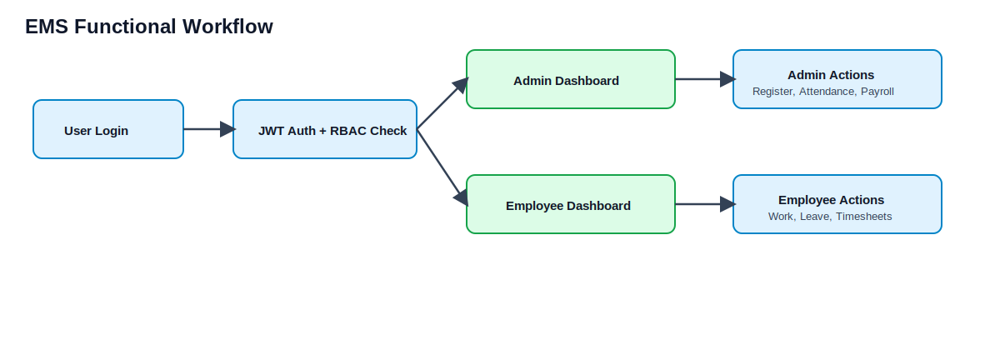
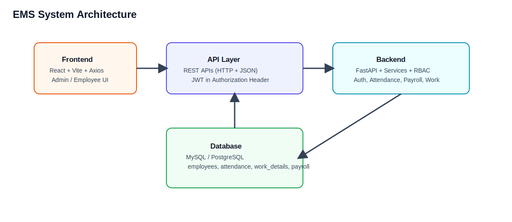
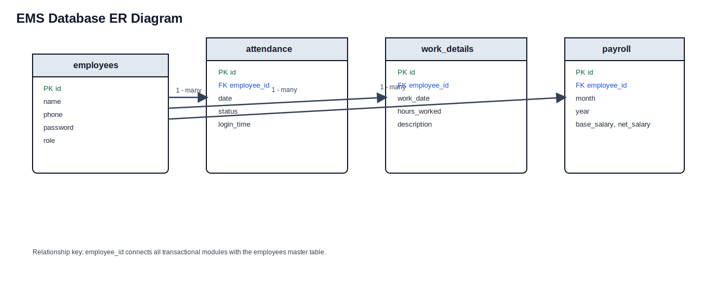
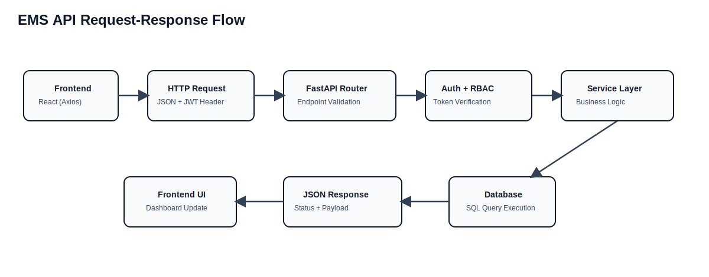

# Employee Management System (EMS) - Project Report

Prepared by: Umashankar Pradhan  
Document Type: Employee Management System  
Date: 23.03.2026  
Version: 1.0

## Contents

1. Introduction
2. Objectives
3. Scope
4. Functional Workflow
5. Functional Requirements
6. System Modules
7. System Architecture
8. Technology Stack
9. Database Design (ER Diagram)
10. API Flow
11. Testing and Results
12. Advantages
13. Limitations
14. Future Enhancements
15. Project Timeline
16. Conclusion

## 1. Introduction

The Employee Management System (EMS) is a web-based application designed to efficiently manage employee-related operations within an organization. It provides a centralized platform for handling employee data, attendance tracking, work management, payroll processing, and reporting.

In traditional systems, managing employee records and operations manually can lead to errors, data redundancy, and inefficiency. EMS overcomes these challenges by automating key processes and ensuring real-time access to accurate information.

The system is built using modern technologies such as React for the frontend and FastAPI for the backend, ensuring high performance, scalability, and security. It also implements JWT-based authentication and role-based access control (RBAC), allowing secure interaction between administrators and employees.

Through this system, administrators can manage employees, monitor attendance, and generate payroll, while employees can track their work, apply for leave, and view their reports.

## 2. Objectives

The main objectives of EMS are:

- Automate employee information and record management.
- Provide secure role-based login for Admin and Employee.
- Track attendance and working hours efficiently.
- Enable employees to add and manage daily work details.
- Generate accurate payroll based on attendance and work data.
- Provide leave application and management.
- Offer real-time reports for better decision-making.
- Reduce manual errors and improve operational efficiency.
- Deliver a scalable and user-friendly platform.

## 3. Scope

### 3.1 In Scope

- Employee registration and secure login.
- Role-Based Access Control (Admin and Employee).
- Attendance management (automatic marking and leave application).
- Work details and timesheet tracking.
- Payroll generation and payroll history.
- Employee performance tracking through work records.
- Reporting for attendance, payroll, and employee data.
- Secure API-based frontend-backend communication.

### 3.2 Out of Scope

- Mobile application support (Android/iOS).
- Biometric or hardware attendance integration.
- External HR or ERP integrations.
- Advanced AI-based performance analytics.
- Multi-organization or multi-branch support.
- Real-time SMS/Email notifications.
- Third-party payment gateway integration.

## 4. Functional Workflow

## 5. Functional Requirements

### 5.1 Registration and Login

The system provides secure authentication for administrators and employees using phone number and password.

#### A) Admin Login

- Admin logs in with secure credentials.
- Access is verified through JWT authentication.
- Admin gets full access to all system features.
- Admin can register employees, view attendance reports, generate payroll, and check payroll history.

#### B) Employee Login

- Employee logs in using phone number and password.
- On successful login, JWT token is generated.
- Attendance is automatically marked as present.
- Employee is redirected to dashboard with restricted access to own data.

### 5.2 Employee Features

- Add work details: daily tasks and work hours.
- View timesheets: history and productivity.
- View attendance report: workdays and leave records.
- Apply for leave: submit leave requests for dates.

### 5.3 Admin Features

- Register employee.
- View attendance reports of all employees.
- Generate payroll using attendance and work data.
- Include salary components: base salary, PF, DA, TA, bonus, and allowances.
- View payroll history.

## 6. System Modules

### 6.1 Authentication Module

Key features:

- Secure login with phone and password.
- Password hashing using bcrypt.
- JWT generation after successful authentication.
- Token-based session handling.
- RBAC for Admin and Employee.

Flow:

- Credentials are verified from database.
- JWT is generated for valid users.
- Token is stored on frontend.
- Protected APIs require valid token.

### 6.2 Employee Module

Key features:

- Employee registration by Admin.
- Employee detail storage (name, phone, role, password).
- Role assignment.
- Unique employee ID management.

Table:

- employees (id, name, phone, password, role)

### 6.3 Attendance Module

Key features:

- Auto attendance mark on login.
- Leave application process.
- Attendance report generation.
- Duplicate attendance prevention.

Table:

- attendance (employee_id, date, status, login_time)

### 6.4 Work Module

Key features:

- Add daily work details.
- Track work hours and task description.
- Timesheet generation.

Table:

- work_details (employee_id, work_date, hours_worked, description)

### 6.5 Payroll Module

Key features:

- Salary calculation from attendance.
- Salary components: base, PF, DA, TA, bonus, allowances.
- Net salary calculation and payroll history.
- Salary slip generation.

Core formula:

Salary = (Base Salary / Total Days) \* Present Days

Table:

- payroll (employee_id, month, year, base_salary, net_salary)

### 6.6 Reporting Module

Key features:

- Attendance report.
- Payroll report.
- Employee summary report.
- Admin dashboard insights.

Data sources:

- attendance
- work_details
- payroll

## 7. System Architecture

## 8. Technology Stack

### 8.1 Frontend

- Language: JavaScript
- Framework: React (Vite)
- Styling: CSS
- Libraries: Axios, Lucide React

### 8.2 Backend

- Language: Python
- Framework: FastAPI
- Server: Uvicorn
- Security: JWT, bcrypt

### 8.3 Database

- MySQL / PostgreSQL
- Relational model with employee_id-based associations

### 8.4 API Layer

- RESTful APIs using JSON over HTTP
- JWT bearer token authorization

Representative APIs:

- POST /login
- POST /register
- POST /work-details
- GET /timesheets/{employee_id}
- POST /attendance/leave
- GET /attendance/report/{employee_id}
- POST /payroll/generate/{employee_id}
- GET /payroll/{employee_id}

## 9. Database Design (ER Diagram)

## 10. API Flow

Detailed flow:

1. User action in frontend triggers API request.
2. Frontend sends request body and JWT token.
3. Backend validates token and role.
4. Service layer executes business logic.
5. SQL query runs against database.
6. Backend returns JSON response.
7. Frontend updates UI based on response.

## 11. Testing and Results

Testing types used:

- Unit testing for individual APIs.
- Integration testing for frontend-backend interactions.
- System testing for complete workflows.

Sample test cases:

| Test Case  | Input                | Expected Output             |
| ---------- | -------------------- | --------------------------- |
| Login      | Valid credentials    | Successful login with token |
| Login      | Invalid credentials  | Error response              |
| Register   | New employee details | Employee created            |
| Attendance | User login           | Attendance marked           |
| Leave      | Apply leave request  | Leave recorded              |
| Payroll    | Generate salary      | Correct salary output       |

Results:

- Core APIs operate correctly.
- Authentication and RBAC controls are enforced.
- Payroll calculations are consistent with attendance data.
- End-to-end response is stable for major flows.

## 12. Advantages

- Reduces manual effort and human errors.
- Enables real-time visibility into employee operations.
- Implements secure JWT authentication.
- Uses clear role-based authorization.
- Supports modular, scalable architecture.
- Improves operational productivity.

## 13. Limitations

- No dedicated mobile app.
- Internet connectivity is required.
- Limited third-party integrations.
- Reporting can be made more advanced.
- No biometric attendance integration in current version.

## 14. Future Enhancements

- Mobile app for Android and iOS.
- Email notifications for leave and payroll.
- Advanced analytics dashboards.
- Cloud deployment readiness.
- Real-time notifications.
- AI-driven performance analytics.
- GPS-based attendance support.
- Export reports in PDF and Excel.

## 15. Project Timeline

| Phase                | Description                                | Duration |
| -------------------- | ------------------------------------------ | -------- |
| Requirement Analysis | Requirement gathering and scope definition | 1 week   |
| System Design        | Architecture and database design           | 1 week   |
| Development          | Frontend and backend implementation        | 3 weeks  |
| Testing              | Debugging and validation                   | 1 week   |
| Deployment           | Hosting and final setup                    | 1 week   |

## 16. Conclusion

The Employee Management System (EMS) is a comprehensive solution for managing employee operations efficiently. It integrates authentication, attendance tracking, work management, payroll processing, and reporting into one platform.

By using React, FastAPI, and a relational database design, the system delivers security, maintainability, and scalability while reducing manual effort. This project demonstrates practical full-stack engineering, secure API design, and business process automation for organizational workforce management.
